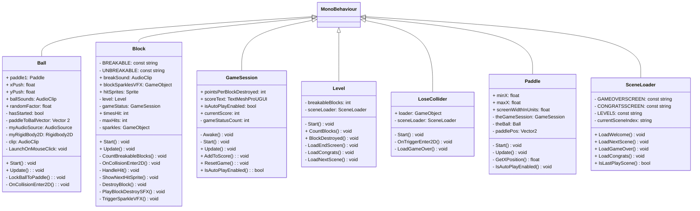

# 11-DebugBlockbreaker-mhuber

```mermaid
classDiagram
    MonoBehaviour <|-- Ball
    MonoBehaviour <|-- Block
    MonoBehaviour <|-- GameSession
    MonoBehaviour <|-- Level
    MonoBehaviour <|-- LoseCollider
    MonoBehaviour <|-- Paddle
    MonoBehaviour <|-- SceneLoader
 
    class Ball {
        + paddle1: Paddle 
        + xPush: float
        + yPush: float
        + ballSounds: AudioClip
        + randomFactor: float
        - hasStarted: bool
        - paddleToBallVector: Vector 2
        - myAudioSource: AudioSource
        - myRigidBody2D: Rigidbody2D
        - clip: AudioClip
        + Start()void 
        + Update(): void
        - LaunchOnMouseClick: void
        - LockBallToPaddle(): void
        - OnCollisionEnter2D(): void
    }
    class Block { 
        - BREAKABLE: const string
        - UNBREAKABLE: const string
        + breakSound: AudioClip
        + blockSparklesVFX: GameObject
        + hitSprites: Sprite 
        - level: Level
        - gameStatus: GameSession 
        + timesHit: int
        - maxHits: int
        - sparkles: GameObject
        + Start()void
        + Update()void 
        - CountBreakableBlocks()void
        - OnCollisionEnter2D()void
        - HandleHit()void
        - ShowNextHitSprite()void
        - DestroyBlock()void
        - PlayBlockDestroySFX()void
        - TriggerSparkleVFX()void
    }
 
    class GameSession {
        + pointsPerBlockDestroyed: int
        + scoreText: TextMeshProUGUI
        + isAutoPlayEnabled: bool
        + currentScore: int
        - gameStatusCount: int
        - Awake()void
        - Start()void
        + Update()void
        + AddToScore(): void
        + ResetGame(): void
        + IsAutoPlayEnabled(): bool 
    }

    class Level {
        - breakableBlocks: int
        - sceneLoader: SceneLoader
        - Start()void
        + CountBlocks()void
        + BlockDestroyed()void
        - LoadEndScreen()void
        - LoadCongrats()void
        - LoadNextScene()void
    }

    class LoseCollider{
        + loader: GameObject
        - sceneLoader: SceneLoader
        - Start()void
        - OnTriggerEnter2D()void
        - LoadGameOver()void
    }

    class Paddle{
        + minX: float
        + maxX: float
        + screenWidthInUnits: float
        - theGameSession: GameSession
        - theBall: Ball
        - paddlePos: Vector2
        - Start()void
        - Update()void
        - GetXPosition()float
        - IsAutoPlayEnabled()void
    }

    class SceneLoader{
        - GAMEOVERSCREEN: const string
        - CONGRATSSCREEN: const string
        - LEVEL5: const string
        - currentSceneIndex: string 
        + LoadWelcome()void
        + LoadNextScene()void
        + LoadGameOver()void
        + LoadCongrats()void
        + IsLastPlayScene()bool
    }
```
